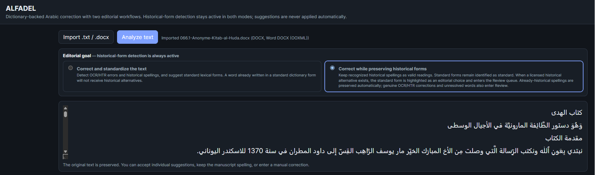
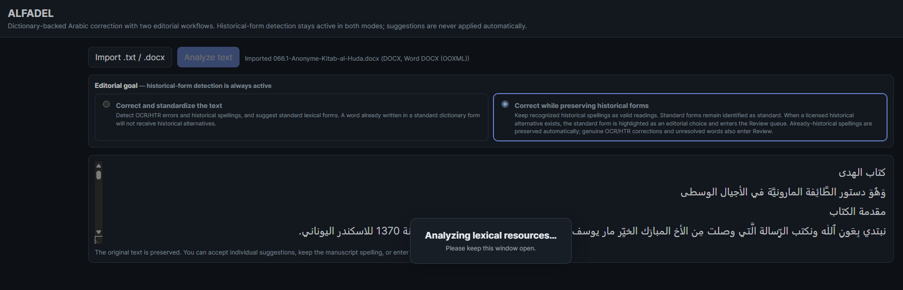
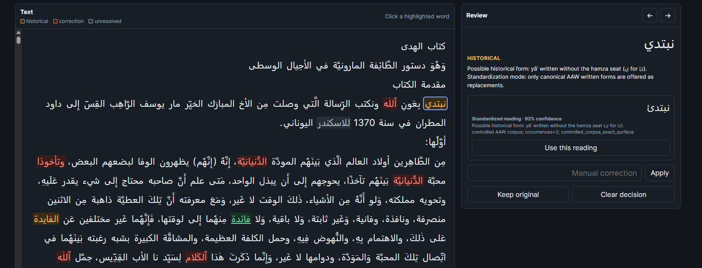
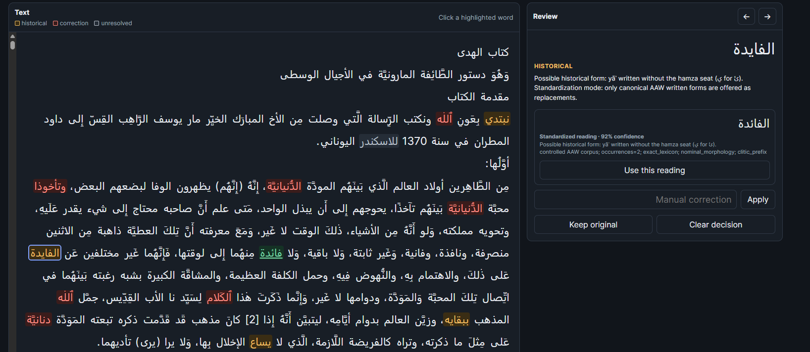
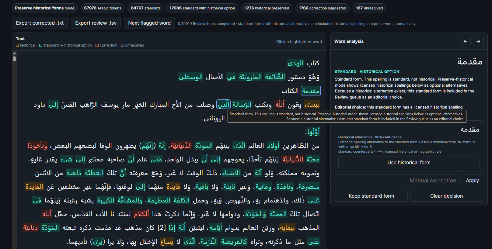

# ALFADEL

### A lexicon-aware environment for correcting Arabic OCR/HTR and editing historical orthography

[](https://doi.org/10.5281/zenodo.22066579)

**ALFADEL** is a local, browser-based application for the assisted correction and editorial preparation of Arabic texts produced by Optical Character Recognition (OCR) or Handwritten Text Recognition (HTR). It is designed particularly for historical Arabic material, where a form that differs from modern orthography is not necessarily an error.

The name **ALFADEL** refers to the eleventh-century Arabic Christian scholar and translator **ʿAbd Allāh ibn al-Faḍl (عبد الله ابن الفضل)**, whose scholarly activity included the revision and correction of Arabic religious texts.

ALFADEL was developed to address a recurring problem in historical-text editing: ordinary spelling correction tends to conflate three different phenomena — **OCR/HTR recognition errors**, **legitimate historical spellings**, and **standard Arabic forms**. ALFADEL therefore treats correction as an editorial decision supported by lexical, morphological, orthographic, and controlled-corpus evidence rather than as automatic replacement.

> **Important:** the public repository contains the ALFADEL software code but **does not include the lexical resources or controlled corpus used during development and testing**. See [Resource provenance and copyright](#resource-provenance-and-copyright) and [PROVENANCE.md](PROVENANCE.md).

## Screenshots

### Main interface



*Figure 1. ALFADEL with a DOCX text loaded in **Correct while preserving historical forms** mode before analysis.*

### Analysis in progress



*Figure 2. ALFADEL loading and analysing the lexical and morphological resources locally.*

### Standardization workflow



*Figure 3. In Standardize mode, a historical spelling is identified and its canonical counterpart is proposed for explicit editorial approval.*



*Figure 4. A second Standardize-mode example showing a proposed reading together with the linguistic evidence used by ALFADEL.*

### Preserve-historical-forms workflow



*Figure 5. In Preserve mode, already-historical spellings are preserved, standard forms with licensed historical alternatives are highlighted as editorial choices, and probable OCR/HTR corrections remain separately marked.*

## Project background

The project began with a simple objective: reuse existing Arabic dictionaries and morphological resources as a validation layer for OCR/HTR correction. An early prototype checked Arabic tokens against the available lexical resources and proposed nearby valid forms when a token was not recognized.

Testing on historical Arabic texts quickly showed that ordinary dictionary lookup was insufficient. Manuscript and early printed Arabic frequently contain orthographic forms that differ from modern standardized spelling but remain historically legitimate. Examples include **ه for ة**, **ي for ئ**, **و for ؤ**, variation in hamza notation, omission of the differentiating alif after plural wāw, and other scribal conventions.

The correction engine was therefore progressively redesigned so that **historical orthography is represented explicitly rather than treated as noise**.

Real-text testing also exposed the need for increasingly precise morphological analysis, especially for Arabic clitics, attached pronouns, weak-final forms, hamza-seat alternations, and cases in which an apparently valid dictionary form results from an implausible segmentation. The application was improved iteratively from concrete examples encountered during editorial work.

Examples that informed the development include:

- **نفسه = نفس + ه**, rather than incorrectly proposing **نفسة**;
- **وتلميذه = و + تلميذ + ه**, rather than **وتلميذة**;
- **سوالهم → سؤالهم**, preserving the attached pronoun while restoring the hamza;
- **ببقايه → ببقائه**, taking account of the orthographic behavior of final hamza before a suffix;
- **فانية**, generated morphologically from the weak-final adjective **فانٍ**;
- **العطايا**, recognized from attested evidence despite the absence of the plural form in the corresponding dictionary entry. More generally, missing dictionary forms were supplemented only when supported by attested evidence, rather than inferred automatically.

These cases helped establish a central principle of the application:

> **Morphological analysis should precede historical normalization, and historical normalization should precede fuzzy OCR/HTR correction.**

## Two editorial workflows

### 1. Correct and standardize the text

In this mode ALFADEL identifies probable OCR/HTR errors and historical spellings and proposes **canonical standard forms**. Historical spelling remains detectable, but historical variants are not proposed as replacements for words that are already standard.

For example, **نبتدي → نبتدئ** may be identified as a historical spelling involving **ي for ئ**, and the standard form can be proposed to the editor.

No correction is applied automatically. The editor may accept a suggestion, preserve the original reading, or enter a manual correction.

### 2. Correct while preserving historical forms

This mode is intended for editions in which historical orthography is to be retained.

An already-historical form such as **نبتدي** is identified as historical and preserved rather than being sent to the normalization Review queue. Its standard counterpart **نبتدئ** may still be displayed as information.

Conversely, when the text contains a standard form for which ALFADEL knows a licensed historical equivalent, the standard form becomes an explicit editorial choice. For example, **صناعة** may be identified as **STANDARD · HISTORICAL OPTION** and **صناعه** offered as a historical alternative.

Preserve mode therefore distinguishes four states:

- **historical** — an already historical spelling that is preserved;
- **standard → historical option** — a standard spelling for which a licensed historical alternative exists;
- **correction** — a probable OCR/HTR error requiring editorial attention;
- **unresolved** — a form for which ALFADEL cannot yet propose a sufficiently reliable analysis.

## How ALFADEL analyses a word

ALFADEL combines several forms of evidence rather than relying on simple string similarity. A token may be evaluated against:

- exact lexical entries;
- generated nominal and verbal morphology;
- Arabic proclitics and combinations of proclitics;
- attached pronominal suffixes;
- lexical stem alternations caused by suffixation;
- explicit historical-orthographic rules;
- attested lexical stems recovered from controlled corpus analyses;
- reviewed lexical additions;
- OCR/HTR-sensitive character similarity;
- weighted edit distance and fuzzy lexical retrieval.

Historical transformations are deliberately constrained. A historically possible graphic transformation is not sufficient by itself to override a stronger normal morphological analysis. For example, the fact that changing final **ه** to **ة** produces another valid word does not make every final **ه** historical: ALFADEL first tests whether the form can be explained as a lexical word followed by the pronoun **ـه**.

## Development methodology

ALFADEL was developed through **iterative error analysis on real Arabic OCR/HTR material**. Rather than attempting to define all rules in advance, problematic analyses were examined individually and, whenever possible, converted into general linguistic constraints.

This development process led to:

- separation of historical spelling from OCR/HTR error;
- strict separation between standardization and preservation workflows;
- prefix- and suffix-aware lexical validation;
- improved treatment of attached pronouns;
- grammatical restrictions on clitic segmentation;
- handling of hamza-seat alternation before suffixes;
- treatment of weak-final nominal and adjectival forms;
- use of explicitly attested irregular forms instead of invented paradigms;
- recovery of nominal lexical stems from controlled corpus analyses;
- ranking of direct morphological analyses above artificial segmentations;
- explicit human editorial control over every replacement;
- visual distinction between linguistic status and editorial action.

The current release is therefore intended as a **scholarly correction and editorial assistance environment for historical Arabic textual material**, rather than a general-purpose modern Arabic spell checker.

## Technologies

ALFADEL is implemented primarily in **Python 3** and uses a lightweight local browser interface. The application deliberately avoids a complex server infrastructure: a local Python HTTP server provides the analysis API while the interface runs in the user's web browser.

Technologies and implementation features include:

- **Python 3** for lexical loading, morphology, tokenization, candidate generation, ranking, historical orthography, document import, and export;
- Python's built-in **`ThreadingHTTPServer`** for the local application server;
- **HTML5, CSS, and vanilla JavaScript** for the browser interface;
- Unicode normalization and Unicode-aware Arabic tokenization;
- custom Arabic morphological and clitic analysis;
- a custom weighted **Damerau–Levenshtein-style distance** adapted to common Arabic OCR/HTR confusions;
- **RapidFuzz** for efficient fuzzy lexical retrieval;
- explicit historical-orthography mappings and rules;
- OOXML parsing using Python's standard XML and ZIP libraries for direct `.docx` import;
- support for UTF-8, UTF-16, and legacy Windows-1256 Arabic text input.

ALFADEL runs locally and does not require the text being edited to be uploaded to an external service.

## Input and output

ALFADEL currently accepts:

- plain text (`.txt`);
- Microsoft Word (`.docx`).

The original text is preserved during analysis. The editor can export:

- corrected text as `.txt`;
- the complete review record as `.tsv`, including the original token, status, editorial decision, replacement, confidence, annotation, evidence, and text position.

## Installation

### Requirements

- Python 3.11 or later;
- `rapidfuzz` (installed from `requirements.txt`);
- legally authorized copies of the external lexical/corpus resources for full linguistic analysis.

### Windows

1. Download or clone this repository.
2. Supply authorized resources locally if available; see [`resources/README.md`](resources/README.md).
3. Run `install_windows.bat` once to install the Python dependency.
4. Run `run_windows.bat` to start ALFADEL.
5. ALFADEL opens locally in the default browser, normally at `http://127.0.0.1:8766/`.

### Other platforms

```bash
python -m pip install -r requirements.txt
python run_alfadel.py
```

The public repository can start with its empty resource placeholders, but full lexical/morphological analysis requires the external resources described below.

## Resource provenance and copyright

### Dictionaries and lexica

The lexical resources used during development and testing were developed within the **AAW project**. These dictionaries and lexica are copyright **Don Davide Righi** and are **not distributed with ALFADEL**.

The public repository preserves only zero-byte resource placeholders documenting the expected directory structure. No rights to copy, redistribute, or relicense the excluded lexical resources are granted by this repository.

### Controlled corpus

The controlled corpus used during development derives from the **e-Cheikho project**, developed between **CEDRAC** and **GREgORI**. It is likewise **not distributed with ALFADEL**.

See [PROVENANCE.md](PROVENANCE.md) and [NOTICE.md](NOTICE.md) for the complete statement.

## Human editorial control

ALFADEL is an **assistance tool**, not an automatic normalization system. The program distinguishes between linguistic evidence and editorial decision. A lexical or historical analysis may establish that a reading is plausible, but the final choice remains with the editor.

No proposed correction or historical substitution is applied without an explicit user decision. This is particularly important for historical texts, where orthography itself may preserve chronological, geographical, scribal, or linguistic information.

## Publication version

This repository represents **ALFADEL v0.1.2**, the initial public publication snapshot.

For changes in this release, see [RELEASE_NOTES_v0.1.2.md](RELEASE_NOTES_v0.1.2.md).

## Citation

Citation metadata are provided in [`CITATION.cff`](CITATION.cff). After the first Zenodo archive is created, the DOI can be added to both `CITATION.cff` and this README.

## Licensing note

The source code is published here for scholarly visibility and reproducibility. **No software license has been selected in this snapshot.** Until an explicit software license is added, normal copyright restrictions apply. The excluded AAW lexical resources and e-Cheikho controlled corpus are not covered by any future license applied to the ALFADEL source code.
